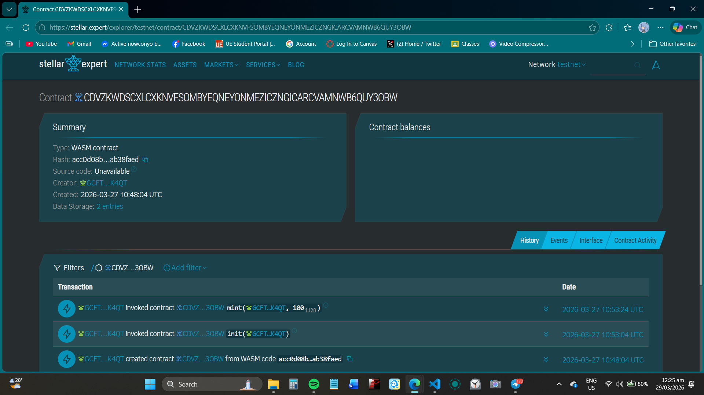

# Coin 🪙

> A campus currency token on Stellar that enables tipping, micro-payments, and creator monetization among students.

---

## Project Description

Coin is a Soroban smart contract deployed on the Stellar blockchain that functions as a campus-issued currency token. The campus admin (a university treasury or institution) mints Coin tokens and distributes them to students. Students can then freely transfer tokens to tip peer tutors, pay for freelance gigs, or reward creative contributions — all settled on-chain with no bank account required.

---

## Project Vision

To build a borderless, inclusive micro-economy inside campus communities across Southeast Asia — where every student contribution, whether tutoring, freelancing, or creating content, has real on-chain value. Coin removes the friction of traditional payments and gives students a verifiable, tamper-proof record of their campus economic activity on Stellar.

---

## Key Features

- **Mint** — Admin issues Coin tokens to students (campus treasury controls supply)
- **Transfer** — Students tip tutors, pay for gigs, or reward creators instantly on-chain
- **Balance** — Any address can check their Coin balance at any time
- **Total Supply** — Transparent view of how many Coin tokens are in circulation
- **Duplicate-proof** — Smart contract enforces correct balances and prevents overspending
- **3 passing unit tests** — Happy path, edge case, and state verification all covered

---

## Deployed Smart Contract Details

| Field | Value |
|---|---|
| **Network** | Stellar Testnet |
| **Contract ID** | `CDVZKWDSCXLCXKNVFSOMBYEQNEYONMEZICZNGICARCVAMNWB6QUY3OBW` |
| **Stellar Expert** | https://stellar.expert/explorer/testnet/contract/CDVZKWDSCXLCXKNVFSOMBYEQNEYONMEZICZNGICARCVAMNWB6QUY3OBW |
| **Stellar Lab** | https://lab.stellar.org/r/testnet/contract/CDVZKWDSCXLCXKNVFSOMBYEQNEYONMEZICZNGICARCVAMNWB6QUY3OBW |

### Block Explorer Screenshot



---

## Future Scope

- **Redemption layer** — Allow students to redeem Coin tokens for real USDC via Stellar's built-in DEX
- **Trustline integration** — Issue Coin as a proper Stellar custom asset with trustline requirements
- **Web front-end** — Student dashboard showing wallet balance, transaction history, and tip buttons
- **Leaderboard** — On-chain ranking of top contributors by Coin earned
- **DAO governance** — Let students vote on token supply and campus treasury decisions via Soroban
- **Mobile app** — QR-code based tipping for face-to-face campus transactions

---

## Stellar Features Used

| Feature | Purpose |
|---|---|
| **Custom tokens** | Coin is a campus-issued token, not XLM |
| **Soroban smart contract** | Mint, transfer, and balance logic on-chain |
| **XLM/USDC transfer** | Gas fees paid in XLM; future USDC redemption path |
| **Trustline** | Students must trust the Coin token before receiving it |

---

## Target Users

University students in Southeast Asia (Philippines, Indonesia, Vietnam) who tutor peers, take on campus freelance gigs, or create content for their college community — and want instant, low-friction payments without a bank account.

---

## Core Feature (MVP)

`transfer(from, to, amount)` — a student sends Coin tokens directly to a peer tutor, freelancer, or creator. The contract verifies the sender has enough balance, debits them, and credits the recipient. One transaction proves the full campus micro-payment loop end-to-end.

---

## Suggested MVP Timeline

| Week | Milestone |
|---|---|
| 1 | Contract written, 3 tests passing locally |
| 2 | Deploy to Stellar testnet; admin mints tokens to pilot cohort |
| 3 | Simple web front-end: wallet view + transfer form |
| 4 | Pilot with one university org; gather feedback |

---

## Prerequisites

- [Rust](https://rustup.rs/) (stable, ≥ 1.74)
- WASM target: `rustup target add wasm32-unknown-unknown`
- Stellar CLI ≥ v21: `cargo install --locked stellar-cli --features opt`
- [Freighter Wallet](https://freighter.app) set to **Testnet**

---

## Build

```bash
stellar contract build
# Output: target/wasm32-unknown-unknown/release/coin.wasm
```

---

## Test

```bash
cargo test
```

Expected passing tests:
- `test_happy_path_tip_peer_tutor`
- `test_transfer_fails_when_insufficient_balance`
- `test_state_correct_after_mint_and_transfer`

---

## Deploy to Testnet

```bash
# 1. Generate identity (first time only)
stellar keys generate --global my-key --network testnet
stellar keys address my-key

# 2. Fund via Friendbot
stellar keys fund my-key --network testnet

# 3. Build
stellar contract build

# 4. Deploy
stellar contract deploy \
  --wasm target/wasm32-unknown-unknown/release/coin.wasm \
  --source my-key \
  --network testnet
```

---

## Sample CLI Invocations

```bash
# Initialise with admin address
stellar contract invoke \
  --id CDVZKWDSCXLCXKNVFSOMBYEQNEYONMEZICZNGICARCVAMNWB6QUY3OBW --source my-key --network testnet \
  -- init \
  --admin <YOUR_ADDRESS>

# Mint 100 Coin to a student
stellar contract invoke \
  --id CDVZKWDSCXLCXKNVFSOMBYEQNEYONMEZICZNGICARCVAMNWB6QUY3OBW --source my-key --network testnet \
  -- mint \
  --to <STUDENT_ADDRESS> \
  --amount 100

# Student tips a tutor 30 Coin
stellar contract invoke \
  --id CDVZKWDSCXLCXKNVFSOMBYEQNEYONMEZICZNGICARCVAMNWB6QUY3OBW --source my-key --network testnet \
  -- transfer \
  --from <STUDENT_ADDRESS> \
  --to <TUTOR_ADDRESS> \
  --amount 30

# Check a balance
stellar contract invoke \
  --id CDVZKWDSCXLCXKNVFSOMBYEQNEYONMEZICZNGICARCVAMNWB6QUY3OBW --source my-key --network testnet \
  -- balance \
  --account <ADDRESS>
```

---

## Project Structure

```
stellar_repo/
├── src/
│   ├── lib.rs              # Soroban smart contract
│   └── test.rs             # Unit tests (3 tests)
├── screenshots/
│   └── contract_explorer.png  # Block explorer screenshot
├── Cargo.toml
└── README.md
```

---

## Resources

| Resource | Link |
|---|---|
| Stellar Bootcamp 2026 | [github.com/armlynobinguar/Stellar-Bootcamp-2026](https://github.com/armlynobinguar/Stellar-Bootcamp-2026) |
| Stellar Docs | [developers.stellar.org](https://developers.stellar.org) |
| Soroban SDK | [docs.rs/soroban-sdk](https://docs.rs/soroban-sdk) |
| Stellar CLI | [developers.stellar.org/docs/tools/stellar-cli](https://developers.stellar.org/docs/tools/stellar-cli) |
| Stellar Expert (Testnet) | [stellar.expert/explorer/testnet](https://stellar.expert/explorer/testnet) |

---

## License

MIT License

Copyright (c) 2026 Coin Contributors

Permission is hereby granted, free of charge, to any person obtaining a copy of this software and associated documentation files (the "Software"), to deal in the Software without restriction, including without limitation the rights to use, copy, modify, merge, publish, distribute, sublicense, and/or sell copies of the Software, and to permit persons to whom the Software is furnished to do so, subject to the following conditions:

The above copyright notice and this permission notice shall be included in all copies or substantial portions of the Software.

THE SOFTWARE IS PROVIDED "AS IS", WITHOUT WARRANTY OF ANY KIND, EXPRESS OR IMPLIED, INCLUDING BUT NOT LIMITED TO THE WARRANTIES OF MERCHANTABILITY, FITNESS FOR A PARTICULAR PURPOSE AND NONINFRINGEMENT. IN NO EVENT SHALL THE AUTHORS OR COPYRIGHT HOLDERS BE LIABLE FOR ANY CLAIM, DAMAGES OR OTHER LIABILITY, WHETHER IN AN ACTION OF CONTRACT, TORT OR OTHERWISE, ARISING FROM, OUT OF OR IN CONNECTION WITH THE SOFTWARE OR THE USE OR OTHER DEALINGS IN THE SOFTWARE.
